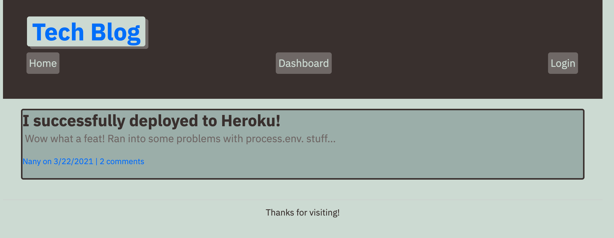

# blog-challenge
This challenge had us build a rudimentary tech blog site. 

## Description
The concepts we used in this challenge were authentication: user login vs. user sign up. We also covered sessions and using session variables. This challenge also served to put together the API routes and the front end and the handlebars templates.

## Additional Information
### Notes
The difficulty with this challenge (and going forward) is losing track of where you were while coding. Having handlebars serve as the front end templates, and the api routes, and the models. It's a lot to keep track of and jumping around can be really tricky. Likewise troubleshooting can also be tricky if you're not isolating your build. Organization is likely going to be the key to keeping all these areas of the application bug free and beautiful. 

Don't mind the Front End on this app it's a little rudimentary but gets the job done.

### Screenshot 
Screenshot of the Front End

### Access Application

* https://github.com/IsiBee/blog-challenge - Github Repo
* https://pure-castle-64217.herokuapp.com/ - Deployed App - Heroku